# CelebrateIt

## Table of Contents

1. [Project Overview](#1-project-overview)

2. [User Experience (UX)](#2-user-experience-ux)

   - 2.1 [Strategy](#21-strategy)
   - 2.2 [Scope](#22-scope)
   - 2.3 [System Architecture](#23-system-architecture)
   - 2.4 [Skeleton](#24-skeleton)
   - 2.5 [Surface](#25-surface)

3. [Features](#3-features)

4. [Technologies Used](#4-technologies-used)

5. [Development](#5-development)

   - 5.1 [Project Planning](#51-project-planning)
   - 5.2 [Code Structure](#53-code-structure)

6. [Testing](#6-testing)

   - 6.1 [Back-End Application Testing](#61-back-end-application-testing)
   - 6.2 [Front-End Application Testing](#62-front-end-application-testing)
   - 6.3 [Bugs and Fixes](#63-bugs-and-fixes)

7. [Deployment & Setup](#7-deployment-and-setup)

   - 7.1 [Backend Deployment](#71-backend-deployment)
   - 7.2 [Local Setup](#72-local-setup)

8. [Credits](#8-credits)

---

## 1. Project Overview

### Brief Description

CelebrateIt is a mock employee recognition platform inspired by the solutions offered by [Workhuman](https://www.workhuman.com). It allows employees to share recognition stories, nominate colleagues for their achievements, and engage with content through likes and comments. By fostering a sense of appreciation and collaboration, CelebrateIt mirrors the functionality and purpose of modern social recognition platforms.

Built using Django REST for the backend and React for the frontend, this project serves as a learning and portfolio exercise, demonstrating full-stack development skills in designing a scalable, functional, and user-friendly web application.

### Target Audience

CelebrateIt is designed for:

- **Employees**: To feel valued and connected by sharing their achievements and recognizing contributions from their colleagues.

- **HR Teams**: To track and analyze recognition trends, fostering a more engaged workforce while identifying top performers and recognizing outstanding contributions.

- **Team Leaders and Managers**: To build a positive team culture by facilitating recognition and appreciation among their team.

- **Companies**: That wish to improve employee satisfaction and retention by integrating a sense of community into their workplace culture.

---

## 2. User Experience (UX)

### 2.1 Strategy

To plan the project development, I adopted an Agile methodology centered on user experience. By using user stories grouped into EPICs, the project is broken down into smaller, manageable pieces, ensuring a structured and user-focused approach.

---

#### **EPIC – Getting Started & Joining the Platform**

| **ID**                                                          | **Theme**                | **User Story**                                                                       | **Prioritisation** |
| --------------------------------------------------------------- | ------------------------ | ------------------------------------------------------------------------------------ | ------------------ |
| [#1](https://github.com/SophieDufrane/PP5-celebrateit/issues/1) | Account Registration     | Users can create an account with basic credentials to join the CelebrateIt platform. | Must Have          |
| [#2](https://github.com/SophieDufrane/PP5-celebrateit/issues/2) | Login to Account         | Users can securely log into their account to access features.                        | Must Have          |
| [#4](https://github.com/SophieDufrane/PP5-celebrateit/issues/4) | Log out of Account       | Users can securely log out to protect their account.                                 | Must Have          |
| [#6](https://github.com/SophieDufrane/PP5-celebrateit/issues/6) | Conditional Menu Options | The menu adapts to login status, showing relevant options.                           | Should Have        |

---

#### **EPIC – Recognition & Nomination CRUD**

| **ID**                                                            | **Theme**               | **User Story**                                                         | **Prioritisation** |
| ----------------------------------------------------------------- | ----------------------- | ---------------------------------------------------------------------- | ------------------ |
| [#11](https://github.com/SophieDufrane/PP5-celebrateit/issues/11) | Create a Recognition    | Users can submit a recognition story to celebrate someone.             | Must Have          |
| [#13](https://github.com/SophieDufrane/PP5-celebrateit/issues/13) | Edit Recognition        | Users can edit a previously shared recognition.                        | Must Have          |
| [#14](https://github.com/SophieDufrane/PP5-celebrateit/issues/14) | Delete Recognition      | Users can delete their recognition story.                              | Must Have          |
| [#15](https://github.com/SophieDufrane/PP5-celebrateit/issues/15) | View Recognition Detail | Users can view the full content of a recognition story.                | Should Have        |
| [#28](https://github.com/SophieDufrane/PP5-celebrateit/issues/28) | View Recognition Feed   | Users can browse all recognitions in the feed.                         | Must Have          |
| [#27](https://github.com/SophieDufrane/PP5-celebrateit/issues/27) | Create a Nomination     | Users can nominate a colleague for recognition using tags.             | Must Have          |
| [#29](https://github.com/SophieDufrane/PP5-celebrateit/issues/29) | Edit Nomination         | Users can update nomination content and tags.                          | Must Have          |
| [#30](https://github.com/SophieDufrane/PP5-celebrateit/issues/30) | Delete Nomination       | Users can remove a nomination they previously made.                    | Must Have          |
| [#31](https://github.com/SophieDufrane/PP5-celebrateit/issues/31) | View Nomination Detail  | Users can view full details of a nomination.                           | Should Have        |
| [#32](https://github.com/SophieDufrane/PP5-celebrateit/issues/32) | View Nomination Feed    | Users can browse all nominations in the feed.                          | Must Have          |
| [#12](https://github.com/SophieDufrane/PP5-celebrateit/issues/12) | View Own Posts          | Users can view a list of recognitions and nominations they’ve created. | Could Have         |

---

#### **EPIC – Engaging with People & Posts**

| **ID**                                                            | **Theme**             | **User Story**                                     | **Prioritisation** |
| ----------------------------------------------------------------- | --------------------- | -------------------------------------------------- | ------------------ |
| [#16](https://github.com/SophieDufrane/PP5-celebrateit/issues/16) | Like a Post           | Users can like a post to show appreciation.        | Should Have        |
| [#17](https://github.com/SophieDufrane/PP5-celebrateit/issues/17) | Comment on a Post     | Users can comment on posts to engage with content. | Must Have          |
| [#33](https://github.com/SophieDufrane/PP5-celebrateit/issues/33) | Edit/Delete Comments  | Users can edit or remove their own comments.       | Should Have        |
| [#8](https://github.com/SophieDufrane/PP5-celebrateit/issues/8)   | Search for Colleagues | Users can search for other people by name.         | Should Have        |

---

#### **EPIC – Managing My Profile & Network**

| **ID**                                                            | **Theme**            | **User Story**                                                      | **Prioritisation** |
| ----------------------------------------------------------------- | -------------------- | ------------------------------------------------------------------- | ------------------ |
| [#22](https://github.com/SophieDufrane/PP5-celebrateit/issues/22) | Edit My Profile      | Users can update their avatar and bio to personalise their profile. | Could Have         |
| [#21](https://github.com/SophieDufrane/PP5-celebrateit/issues/21) | View Public Profiles | Users can view other users’ bios and shared posts.                  | Must Have          |

---

### 2.2 Scope

All features listed above are prioritised using the **MoSCoW Framework** to guide development focus and ensure a successful MVP.

The current breakdown is:

- **Must Have** (13 / 21 → 62%): Core functionality required for project success.

- **Should Have** (6 / 21 → 28%): Enhancements that improve usability and experience.

- **Could Have** (2 / 21 → 10%): Nice-to-have features if time allows.

- **Won’t Have**: Explicitly removed from scope.

This distribution ensures alignment with project constraints and focus, while still allowing space for polish and stretch goals where appropriate.

### Entity Relationship Diagram (ERD)

The ERD provides a high-level overview of the database structure, including the relationships between key models such as users, profiles, recognitions, nominations, tags, comments, and likes. It was designed early in the planning phase to ensure consistent field usage and API compatibility.


#### Flowchart for User Navigation

This section provides a visual representation of the user navigation flow within CelebrateIt. The flowchart captures how users interact with the platform, including key actions such as logging in, browsing stories, creating recognition posts, and navigating between profile pages.


---

### 2.3 System Architecture

CelebrateIt follows a decoupled architecture, separating the backend and frontend into two distinct layers:

- **Backend**: Built with Django REST Framework (DRF), the backend exposes a RESTful API. It handles authentication, user profiles, nominations, recognitions, comments, likes, and tag/category logic. The API returns JSON responses that can be consumed by any client.
- **Frontend**: Developed using React, the frontend interacts with the API via `axios`. It handles routing with React Router, manages state locally (with hooks), and presents a dynamic interface to the user.
- **Data Flow**: React fetches data from DRF endpoints and displays it based on the user's interactions. Forms (e.g. create/edit nomination) submit data back to the API to update the database.
- **Authentication**: User sessions and permissions are managed via Django Allauth and token-based headers on the frontend.
- **Media and Hosting**:
  - User-uploaded images are stored on **Cloudinary**
  - Both frontend and backend are deployed via **Heroku** using a single monorepo setup, ensuring a unified deployment pipeline and simplified maintenance.

This architecture supports scalability and flexibility, allowing future iterations such as mobile apps or third-party integrations to use the same backend API.

---

### 2.4 Skeleton

#### Wireframes for Key Screens or Pages

The following wireframes outline the structure and layout of the main screens in CelebrateIt:

- **Secure Authentication**

  - Employees register, log in and out securely using **Django Allauth**.

      <details>
      <summary> Register an Account </summary>

    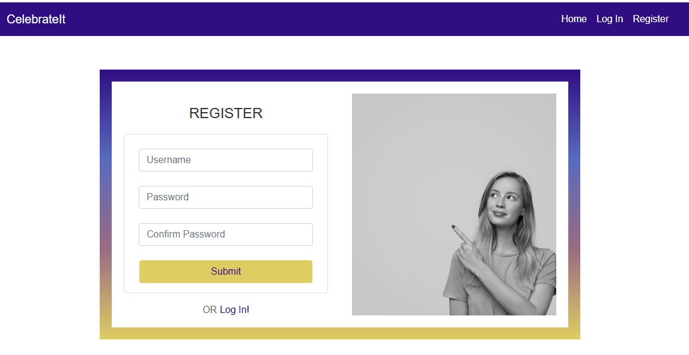

      </details>

      <details>
      <summary> Log in to an existing Account </summary>

    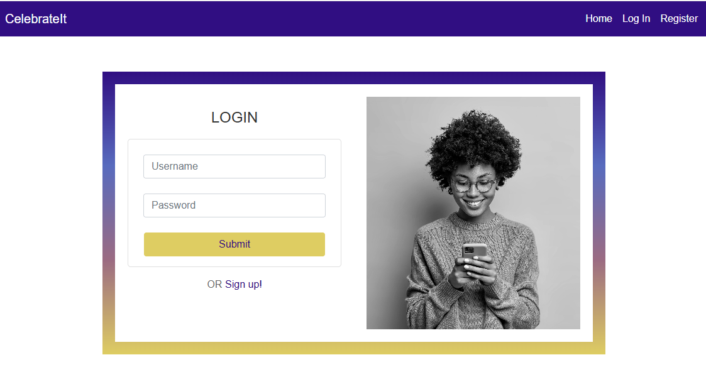

      </details>

---

### 2.5 Surface

#### Typography & Colour Scheme

CelebrateIt builds on the visual identity of the previous Rewards Platform (PP4 - RedeemIt), maintaining a clean, user-friendly interface with a more social and collaborative tone.

The colour palette echoes tech industry trends while adding warmth to reflect human connection in the workplace. Fonts were chosen for readability and a modern feel.

#### Colour Palette

| **Colour** | **Name**         |
| ---------- | ---------------- |
| `#300E82`  | Persian Indigo   |
| `#586BBE`  | Savoy Blue       |
| `#9B6B82`  | Mountbatten Pink |
| `#DECD62`  | Citron           |
| `#484848`  | Davy's Grey      |


<details>
  <summary>Click to view inspiration from Workhuman</summary>
  
</details>

### Typography

- **Primary Font**: _Poppins_ – main body text
- **Secondary Font**: _Quicksand_ – used for highlights and UI accents

---

## 3. Features

### Implemented Features

- Secure user registration and login via Django Allauth
- Conditional navigation menu that adapts to auth state
- Create, edit, delete, and view **Recognition** stories
- Create, edit, delete, and view **Nominations** with required tags
- Combined feed with toggle to switch between Recognition and Nominations
- Detail pages for each recognition and nomination
- Real-time **like** system for posts and nominations
- **Comment** system with edit and delete options for authors
- Public profile pages showing user's info and contributions
- Logged-in users can **edit their avatar and bio**
- **Search bar** to find colleagues from the feed by name
- Profile feed toggle: view your own recognitions and nominations

### Upcoming or In Progress

- Finalise Nomination CRUD frontend integration
- Frontend tests and confirmation prompts
- Final styling and responsiveness tweaks
- README completion with testing documentation
- Heroku deployment (backend) and potential CI setup

---

## 4. Technologies Used

### Frontend

- React
- React Router DOM
- Axios
- Bootstrap
- CSS Modules

### Backend

- Django
- Django REST Framework
- Django Allauth
- PostgreSQL (via Heroku)
- Cloudinary (for image uploads)

### Deployment & Tools

- Heroku (backend)
- GitHub & GitHub Pages (optional frontend deployment)
- Git & GitHub for version control
- VS Code
- Insomnia/Postman for API testing
- Lighthouse & DevTools for performance/accessibility audits

---

## 5. Development

## 5.1 Project Planning

### Frontend Page and Component Structure

Before starting frontend development, a complete architecture plan was created to ensure clean, reusable, and modular code.

#### Pages Overview

| Page                  | Purpose                                                              |
| :-------------------- | :------------------------------------------------------------------- |
| MenuPage or LoginPage | Form to Login or Register                                            |
| LoggedInHomePage      | Displays Recognition and Nomination feed alongside People Sidebar    |
| PostDetailPage        | Shows full recognition story with likes and comments                 |
| CreatePostPage        | Form to create a recognition Story (title, content, optionnal image) |
| UpdatePostPage        | Form for updating an existing recognition story                      |
| NominationDetailPage  | Shows full nomination details with likes and comments                |
| CreateNominationPage  | Form to create a new nomination (nominee, title, content, and tag)   |
| UpdateNominationPage  | Form for updating an existing nomination                             |
| ProfilePage           | Displays user profile, recognitions, and nominations                 |

---

#### Major Containers and Components

| Container             | Purpose                                                              |
| :-------------------- | :------------------------------------------------------------------- |
| LoggedInHomePage      | Fetches and display feed and people list                             |
| PostDetailPage        | Fetches and display single recognition post                          |
| NominationDetailPage  | Fetches and display single nomination                                |
| CreateRecognitionPage | Handles the form for a new recognition                               |
| CreateNominationPage  | Handles the form for a new nomination                                |
| ProfilePage           | Fetches and displays user information, recognitions, and nominations |

| Component | Purpose                                                     |
| :-------- | :---------------------------------------------------------- |
| Navbar    | Navigation bar (Home, Recognize, Nominate, Profile, Logout) |
| Post      |                                                             |

---

### Frontend Page and Component Structure

```
Navbar (component)
│
├── Brand (CelebrateIt link to "/")
├── Home Link (to "/")
├── Recognize Link (to "posts/create")
├── Nominate Link (to "nominations/create")
├── Profile Link (to "/profiles/:id" - dynamic user ID)
└── Logout Link (logs out and redirects to login page "/login")


LoggedInHomePage (container)
│
├── Navbar (component)
│
│── FeedSection (container)
│   ├── FeedToggleButtons (component)
│   ├── FeedList (component)
│   |    ├── PostCard (component - for recognition posts)
│   |    │    ├── LikeButton (component)
│   |    │    └── CommentCounter (component)
│   |    └── NominationCard (component - for nominations)
│   │              ├── LikeButton (component)
│   │              └── CommentCounter (component)
│   │
│   └── PeopleSidebar (container)
│         ├── SearchField (component)
│         └── PeopleList (component)
│             ├── PersonCard (component)
│                 ├── User Icon
│                 ├── User name
│                 └── NominateButton (component)


PostDetailPage (container)
│
├── PostCard (component)
│    ├── LikeButton (component)
│    └── CommentCounter (component)
│
└── CommentSection (component)
     ├── CommentForm (component)
     └── CommentList (component)
         ├── CommentCard (component)
         ├── CommentCard (component)
         └── ….etc


NominationDetailPage (container)
│
├── NominationCard (component)
│    ├── LikeButton (component)
│    └── CommentCounter (component)
│
└── CommentSection (component)
     ├── CommentForm (component)
     └── CommentList (component)
         ├── CommentCard (component)
         ├── CommentCard (component)
         └── ….etc


CreatePage (container)
│
├── Title ("What would you like to create?")
│
└── CreateOptions (container)
     ├── CreateRecognitionCard (component)
     │    └── Button to redirect to /create-recognition
     └── CreateNominationCard (component)
          └── Button to redirect to /create-nomination


CreateRecognitionPage (container)
│
└── RecognitionForm (component)
     ├── TitleField (component)
     ├── ContentField (component)
     ├── ImageUploadField (component) (optional)
     └── SubmitButton (component)


CreateNominationPage (container)
│
└── NominationForm (component)
     ├── NomineeSelector (component) (pick a person or prefilled if clicked from sidebar)
     ├── TitleField (component) (required)
     ├── ContentField (component) (required)
     ├── TagField (component) (required - colorful category)
     └── SubmitButton (component)


ProfilePage (container)
│
├── ProfileHeader (component)
│    ├── Profile Image
│    ├── Username (First and Last name)
│    ├── Department
│    └── Bio / Presentation text
│
└── ProfileFeedSection (container)
     ├── FeedToggleButtons (component) (My Recognitions / My Nominations)
     └── FeedList (component)
          ├── PostCard (for recognitions)
          └── NominationCard (for nominations)
```

#### Key Planning Decisions

- Reusable Components were prioritized to speed up development and minimize duplication.
- Toggle Functionality was reused between the Home Feed and the Profile Feed to allow switching between Recognitions and Nominations.
- Simplifications were made to keep the project realistic and deadline-safe, such as skipping advanced department filters initially.
- Alignment with Backend Models was ensured before form design to prevent API mismatches (fields and validation match Django models).
- Comment Sections are embedded inside Post and Nomination Detail Pages, rather than being handled by separate comment pages.

---

- Agile methodology, Kanban, or other approaches used

### 5.2 Code Structure

The project is divided into feature-based Django apps:

- `posts/` – Recognition stories and related logic
- `nominations/` – Peer nominations with required tag selection
- `profiles/` – User profile extensions with department links
- `likes/` and `comments/` – Shared interactions for both posts and nominations
- `tags/` – Used to categorize recognitions and nominations
- `department/` – Departments available for user filtering and classification

Each app follows the same structure: `models.py`, `serializers.py`, `views.py`, and `urls.py`. Common permissions are stored in the main `celebrateit_api/permissions.py`.

---

## 6. Testing

### 6.1 Back-End Application Testing

The following tests were conducted manually to verify the functionality, permissions, and expected behavior of the back-end API endpoints. All tests were performed using the Django REST Framework browsable API interface through the browser.

Each section below corresponds to a model and includes the tested endpoint, HTTP method, required authentication, expected behavior, actual results, and screenshots where relevant.

#### **User Profiles**

| Endpoint                           | Action                     | Method | Auth | Expected                                         | Actual | Screenshot |
| ---------------------------------- | -------------------------- | ------ | ---- | ------------------------------------------------ | ------ | ---------- |
| `/user-profiles/`                  | List all user profiles     | GET    | ❌   | HTTP 200 OK                                      | ✅     | 1          |
| `/user-profiles/10/`               | View profile detail        | GET    | ❌   | HTTP 200 OK                                      | ✅     | 2          |
| `/user-profiles/9/`                | Update profile (owner)     | PUT    | ✅   | HTTP 200 OK / Profile updated                    | ✅     | 3          |
| `/user-profiles/10/`               | Update profile (not owner) | PUT    | ✅   | HTTP 403 Forbidden / Profile should be read-only | ✅     | 4          |
| `/user-profiles/?department=SALES` | Filter by department       | GET    | ❌   | HTTP 200 OK / Only SALES users                   | ✅     | 5          |
| `/user-profiles/?search=raymond`   | Search by name             | GET    | ❌   | HTTP 200 OK / Only Profiles with \"raymond\"     | ✅     | 6          |

<details>
<summary> 1/ List all user profiles </summary>


</details>

<details>
<summary> 2/ View profile detail </summary>


</details>

<details>
<summary> 3/ Update profile (owner) </summary>


</details>

<details>
<summary> 4/ Update profile (not owner) </summary>


</details>

<details>
<summary> 5/ Filter by department </summary>


</details>

<details>
<summary> 6/ Search by name </summary>


</details>

#### **Posts**

| Endpoint                   | Action                    | Method | Auth | Expected                                                  | Actual | Screenshot |
| -------------------------- | ------------------------- | ------ | ---- | --------------------------------------------------------- | ------ | ---------- |
| `/posts/`                  | List all the posts        | GET    | ❌   | HTTP 200 OK                                               | ✅     | 1          |
| `/posts/4/`                | View a post detail        | GET    | ❌   | HTTP 200 OK                                               | ✅     | 2          |
| `/posts/`                  | Create a post             | POST   | ✅   | HTTP 201 Created                                          | ✅     | 3          |
| `/posts/5/`                | Update a post (owner)     | PUT    | ✅   | HTTP 200 OK / Post updated successfully                   | ✅     | 4          |
| `/posts/1/`                | Update a post (not owner) | GET    | ✅   | HTTP 403 Forbidden / Post should be read-only             | ✅     | 5          |
| `/posts/2/`                | Delete a post (owner)     | DELETE | ✅   | HTTP 204 No Content                                       | ✅     | 6          |
| `/posts/1/`                | Delete a post (not owner) | DELETE | ✅   | HTTP 403 Forbidden / Post should be read-only             | ✅     | 7          |
| `/posts/?search=raymond`   | Search by name            | GET    | ❌   | HTTP 200 OK / Only posts with \"raymond\"                 | ✅     | 8          |
| `/posts/?department=SALES` | Filter by department      | GET    | ❌   | HTTP 200 OK / Only posts from users in department "SALES" | ✅     | 9          |

<details>
<summary> 1/ List all the posts </summary>

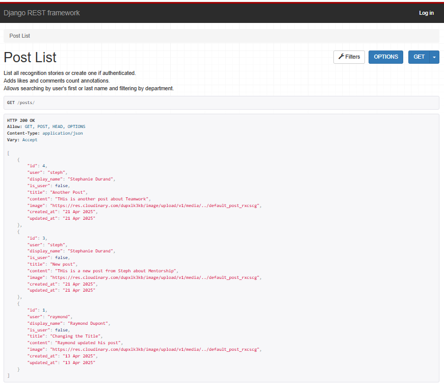

</details>

<details>
<summary> 2/ View a post detail </summary>

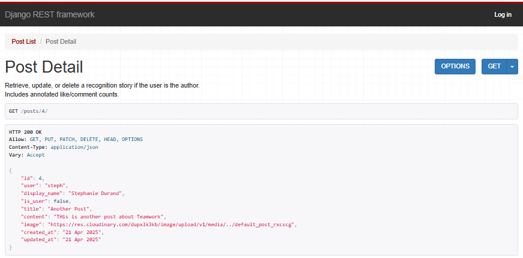

</details>

<details>
<summary> 3/ Create a post </summary>


</details>

<details>
<summary> 4/ Update a post (owner) </summary>

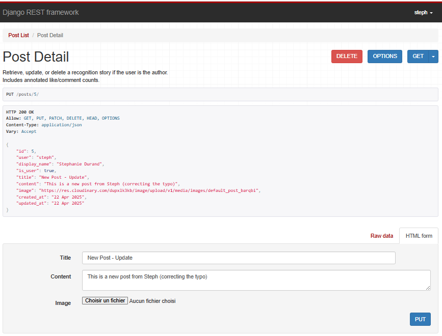

</details>

<details>
<summary> 5/ Update a post (not owner) </summary>


</details>

<details>
<summary> 6/ Delete a post (owner) </summary>


</details>

<details>
<summary> 7/ Delete a post (not owner) </summary>


</details>

<details>
<summary> 8/ Search by name </summary>


</details>

<details>
<summary> 9/ Search by department </summary>


</details>

#### **Nominations**

| Endpoint                                             | Action                           | Method | Auth | Expected                                                       | Actual | Screenshot |
| ---------------------------------------------------- | -------------------------------- | ------ | ---- | -------------------------------------------------------------- | ------ | ---------- |
| `/nominations/`                                      | List all the nominations         | GET    | ❌   | HTTP 200 OK                                                    | ✅     | 1          |
| `/nominations/1/`                                    | View a nomination detail         | GET    | ❌   | HTTP 200 OK                                                    | ✅     | 2          |
| `/nominations/`                                      | Create a nomination              | POST   | ✅   | HTTP 201 Created                                               | ✅     | 3          |
| `/nominations/7/`                                    | Update a nomination (owner)      | PUT    | ✅   | HTTP 200 OK / Nomination updated successfully                  | ✅     | 4          |
| `/nominations/1/`                                    | Update a nomination (not owner)  | GET    | ✅   | HTTP 403 Forbidden / Nomination should be read-only            | ✅     | 5          |
| `/nominations/7/`                                    | Delete a nomination (owner)      | DELETE | ✅   | HTTP 204 No Content                                            | ✅     | 6          |
| `/nominations/1/`                                    | Delete a nomination (not owner)  | DELETE | ✅   | HTTP 403 Forbidden / Nomination should be read-only            | ✅     | 7          |
| `/nominations/?search=raymond`                       | Search by nominee/nominator      | GET    | ❌   | HTTP 200 OK / Only nominations involving "raymond"             | ✅     | 8          |
| `/nominations/?nominator__profile__department=SALES` | Filter by department (nominator) | GET    | ❌   | HTTP 200 OK / Only nominations from "SALES" nominator profiles | ✅     | 9          |
| `/nominations/?tag=3`                                | Filter by tag                    | GET    | ❌   | HTTP 200 OK / Only nominations with "Innovation" tag (ID=3)    | ✅     | 10         |
| `/nominations/?nominee=2`                            | Filter by nominee                | GET    | ❌   | HTTP 200 OK / Only nominee "steph" (ID=2)                      | ✅     | 11         |

<details>
<summary> 1/ List all the nominations </summary>

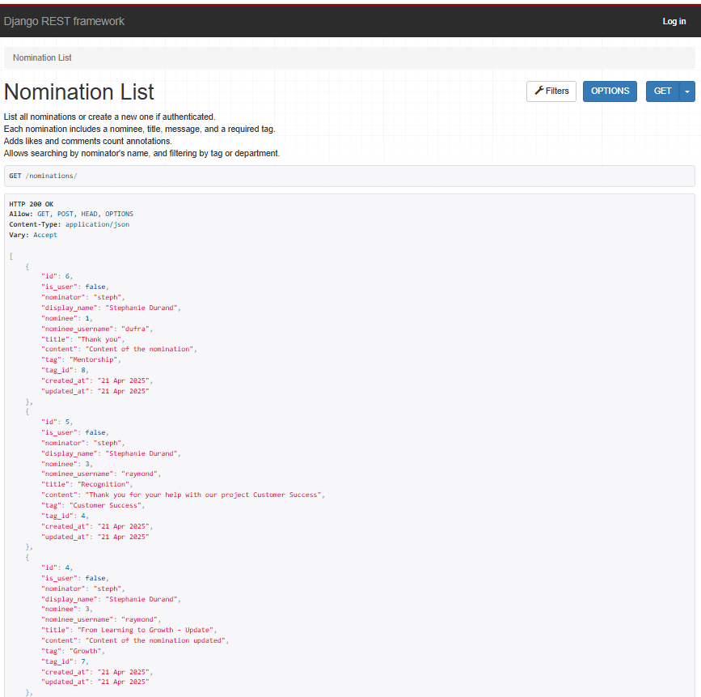

</details>

<details>
<summary> 2/ View a nomination detail </summary>

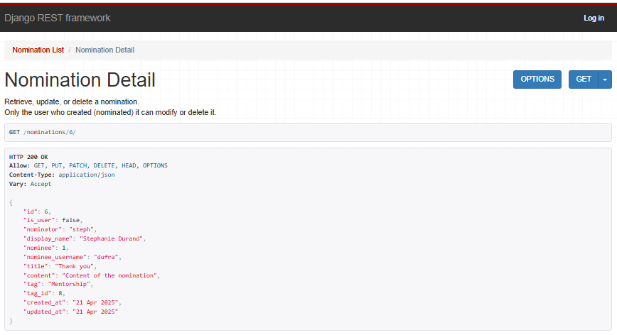

</details>

<details>
<summary> 3/ Create a nomination </summary>


</details>

<details>
<summary> 4/ Update a nomination (owner) </summary>

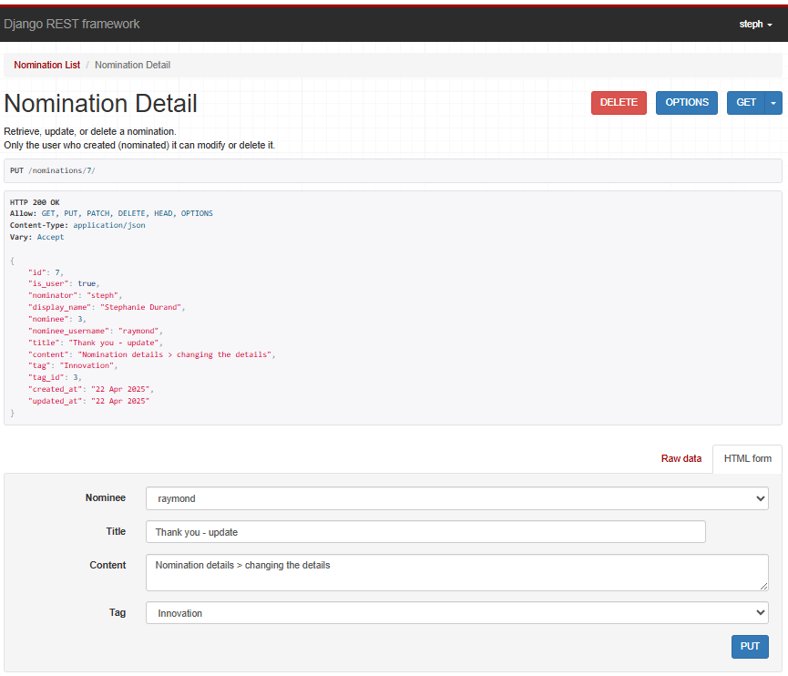

</details>

<details>
<summary> 5/ Update a nomination (not owner) </summary>

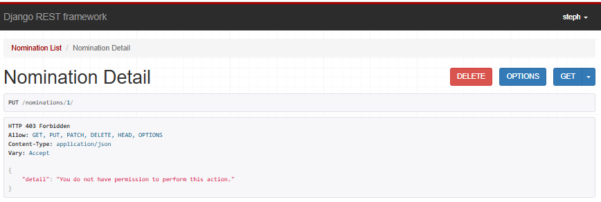

</details>

<details>
<summary> 6/ Delete a nomination (owner) </summary>


</details>

<details>
<summary> 7/ Delete a nomination (not owner) </summary>


</details>

<details>
<summary> 8/ Search by nominee/nominator </summary>


</details>

<details>
<summary> 9/ Filter by department (nominator) </summary>


</details>

<details>
<summary> 10/ Filter by tag </summary>


</details>

<details>
<summary> 11/ Filter by nominee </summary>


</details>

#### **Comments**

| Endpoint                  | Action                              | Method | Auth | Expected                                    | Actual | Screenshot |
| ------------------------- | ----------------------------------- | ------ | ---- | ------------------------------------------- | ------ | ---------- |
| `/comments/`              | List all the comments               | GET    | ❌   | HTTP 200 OK                                 | ✅     | 1          |
| `/comments/`              | Create a comment on post/nomination | POST   | ✅   | HTTP 201 Created                            | ✅     | 2          |
| `/comments/4/`            | Update a comment (owner)            | PUT    | ✅   | HTTP 200 OK / Comment updated successfully  | ✅     | 3          |
| `/comments/4/`            | Delete a comment (owner)            | DELETE | ✅   | HTTP 204 No Content                         | ✅     | 4          |
| `/comments/?post=4`       | Filter by post                      | GET    | ❌   | HTTP 200 OK / Only comments on post 4       | ✅     | 5          |
| `/comments/?nomination=3` | Filter by nomination                | GET    | ❌   | HTTP 200 OK / Only comments on nomination 3 | ✅     | 6          |

<details>
<summary> 1/ List all the comments </summary>


</details>

<details>
<summary> 2/ Create a comment </summary>

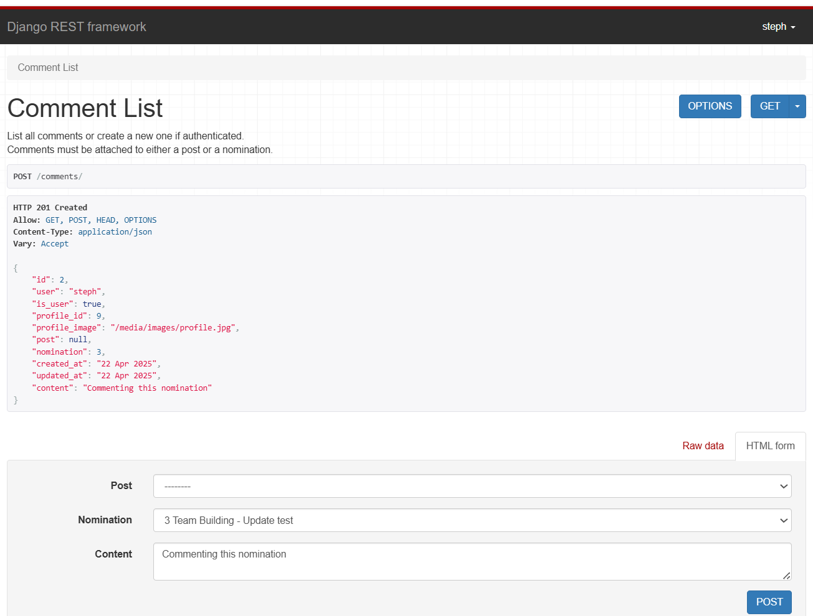

</details>

<details>
<summary> 3/ Update a comment (owner) </summary>


</details>

<details>
<summary> 4/ Delete a comment (owner) </summary>


</details>

<details>
<summary> 5/ Filter by post </summary>

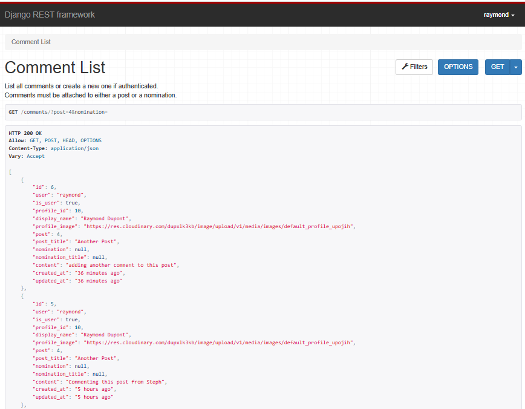

</details>

<details>
<summary> 6/ Filter by nomination </summary>


</details>

#### **Likes**

| Endpoint    | Action                               | Method | Auth | Expected                               | Actual | Screenshot |
| ----------- | ------------------------------------ | ------ | ---- | -------------------------------------- | ------ | ---------- |
| `/likes/`   | Create a like on post/nomination     | POST   | ✅   | HTTP 201 Created                       | ✅     | 1          |
| `/likes/`   | Invalid: like both post & nomination | POST   | ✅   | HTTP 400 Bad Request / Can’t like both | ✅     | 2          |
| `/likes/`   | Invalid: like same thing twice       | POST   | ✅   | HTTP 400 Bad Request / Already liked   | ✅     | 3          |
| `/likes/5/` | Delete a like (owner)                | DELETE | ✅   | HTTP 204 No Content                    | ✅     | 4          |

<details>
<summary> 1/ Create a like on post/nomination </summary>

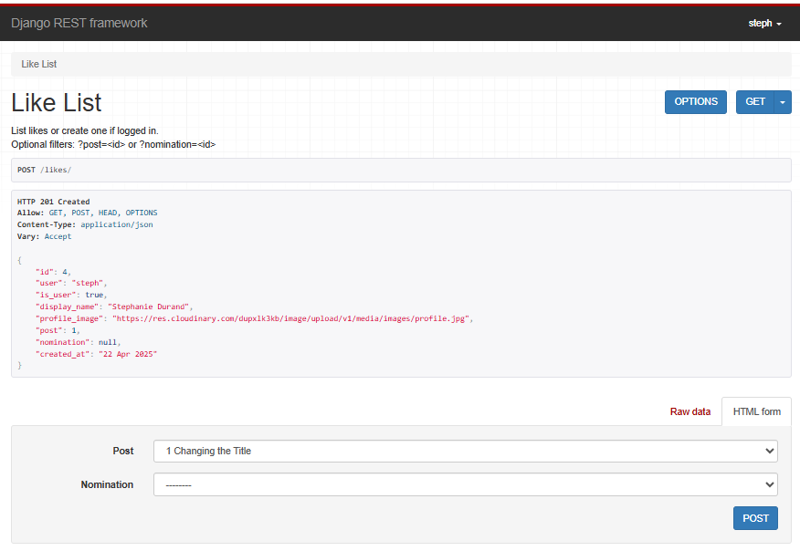

</details>

<details>
<summary> 2/ Invalid: like both post & nomination </summary>


</details>

<details>
<summary> 3/ Invalid: like same thing twice </summary>

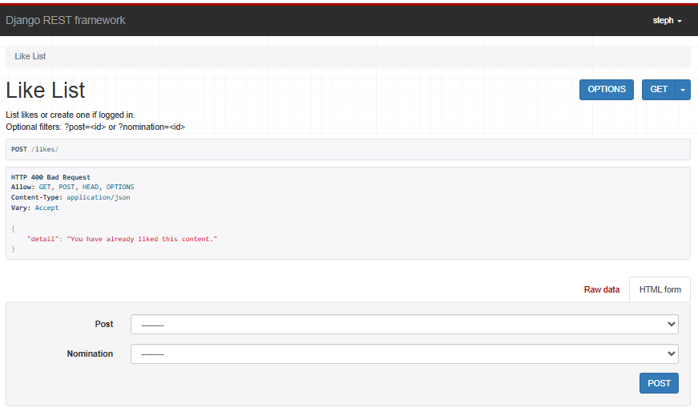

</details>

<details>
<summary> 4/ Delete a like (owner) </summary>


</details>

#### **Departments (via Profiles, Posts, Nominations)**

| Endpoint                                           | Action                                      | Method | Auth | Expected                                                 | Actual | Screenshot |
| -------------------------------------------------- | ------------------------------------------- | ------ | ---- | -------------------------------------------------------- | ------ | ---------- |
| `/user-profiles/`                                  | List profiles with department field visible | GET    | ❌   | HTTP 200 OK / Department value shown per profile         | ✅     | 1          |
| `/user-profiles/10`                                | Profile detail with department field        | GET    | ❌   | HTTP 200 OK / Department is correct for the user         | ✅     | 2          |
| `/posts/?user__profile__department=OPS`            | Filter posts by user department             | GET    | ❌   | HTTP 200 OK / Only posts from users in Operation         | ✅     | 3          |
| `/nominations/?nominator__profile__department=OPS` | Filter nominations by nominator department  | GET    | ❌   | HTTP 200 OK / Only nominations from Operation nominators | ✅     | 4          |

<details>
<summary> 1/ List profiles with department field visible </summary>


</details>

<details>
<summary> 2/ Profile detail with department field </summary>

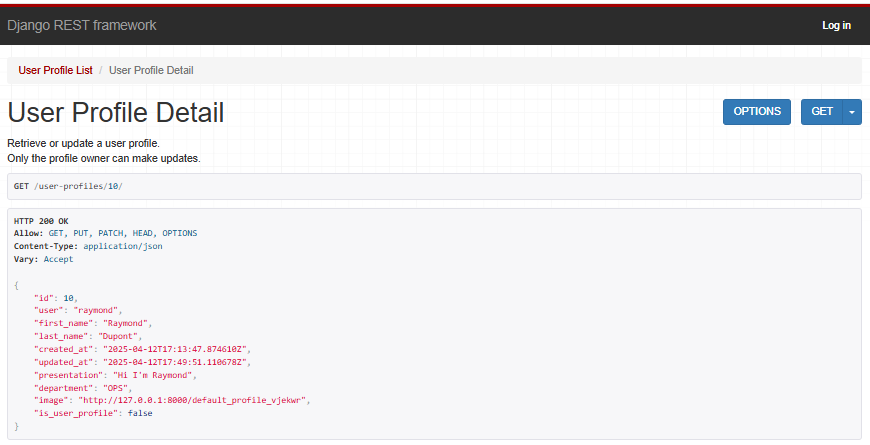

</details>

<details>
<summary> 3/ Filter posts by user department </summary>

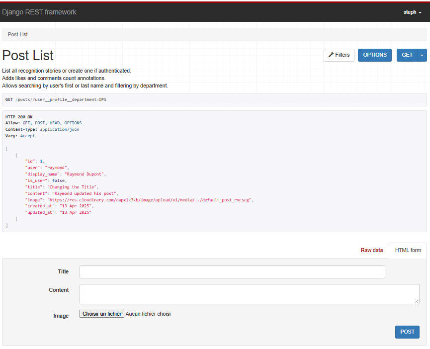

</details>

<details>
<summary> 4/ Filter nominations by nominator department </summary>

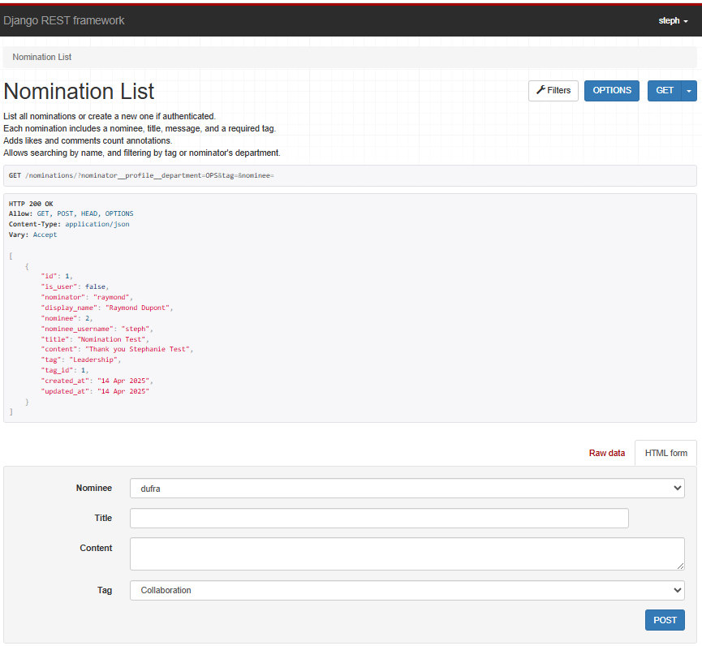

</details>

#### **Tags**

| Endpoint               | Action                     | Method | Auth | Expected                                                  | Actual | Screenshot |
| ---------------------- | -------------------------- | ------ | ---- | --------------------------------------------------------- | ------ | ---------- |
| `/tags/`               | List all tags              | GET    | ❌   | HTTP 200 OK / All available tags listed                   | ✅     | 1          |
| `/nominations/`        | Create nomination with tag | POST   | ✅   | HTTP 201 Created / Nomination includes correct tag        | ✅     | 2          |
| `//nominations/?tag=3` | Filter nominations by tag  | GET    | ❌   | HTTP 200 OK / Only nominations with tag Innovation (ID=3) | ✅     | 3          |

<details>
<summary> 1/ List all tags </summary>


</details>

<details>
<summary> 2/ Create nomination with tag </summary>

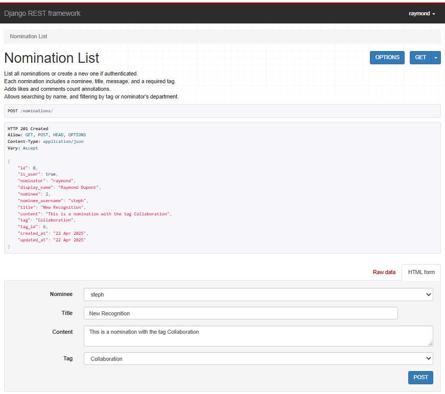

</details>

<details>
<summary> 3/ Filter nominations by tag </summary>


</details>

### 6.2 Front-End Application Testing

All manual testing was performed on the deployed frontend using a real user account. Each user story was tested with expected interactions and outcomes, covering both positive and negative cases.

Testing included:

- Auth flows (register, login, logout)
- Recognition and nomination CRUD
- Feed behaviour and toggling
- Detail page rendering
- Like and comment functionality
- User profile views and editing
- Search bar and sidebar interactions

#### **Getting Started & Joining the Platform**

| **Priority** | **User Story**           | **Page(s)**       | **Test Scenario / Action**                      | **Expected Result**                                                                | Actual | **Screenshot** |
| ------------ | ------------------------ | ----------------- | ----------------------------------------------- | ---------------------------------------------------------------------------------- | ------ | -------------- |
| Must Have    | Register an Account      | Register Page     | Fill out form with valid inputs and submit      | Redirected to login, message confirms successful registration                      | ✅     | 1 - 2          |
| Must Have    | Login to Account         | Login Page        | Enter valid credentials and submit              | Redirected to feed with user menu visible                                          | ✅     | 3              |
| Must Have    | Logout                   | Any Page (Navbar) | Click logout                                    | User is logged out and redirected to login, message confirms successful logged out | ✅     | 4              |
| Must Have    | Conditional Menu Options | All Pages         | Login and check navbar / Logout and check again | Menu adapts based on login status                                                  | ✅     | 5 - 6          |

<details>
<summary> 1/ Register – Validation Errors Display </summary>

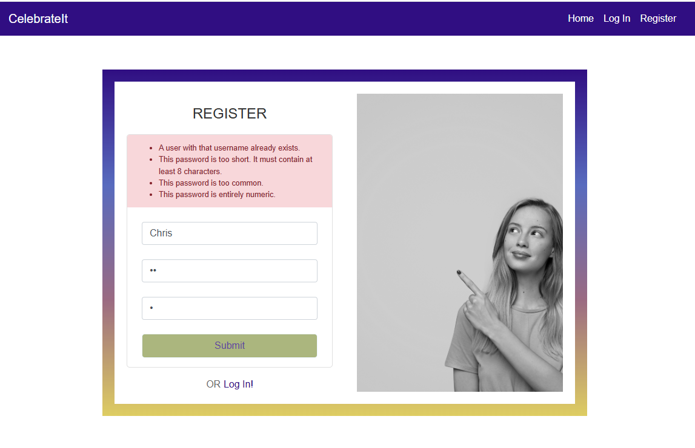

</details>

<details>
<summary> 2/ Register - Successful message </summary>

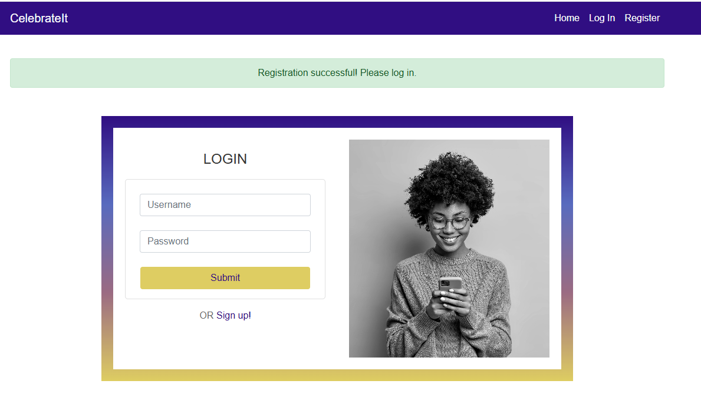

</details>

<details>
<summary> 3/ Log In - Validation Errors Display </summary>

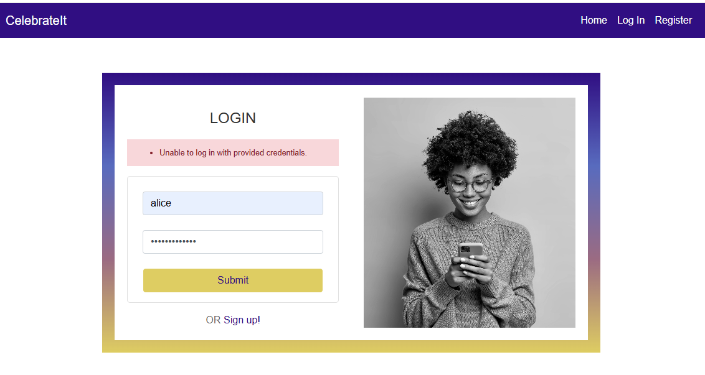

</details>

<details>
<summary> 4/ Logged out - Successful message </summary>

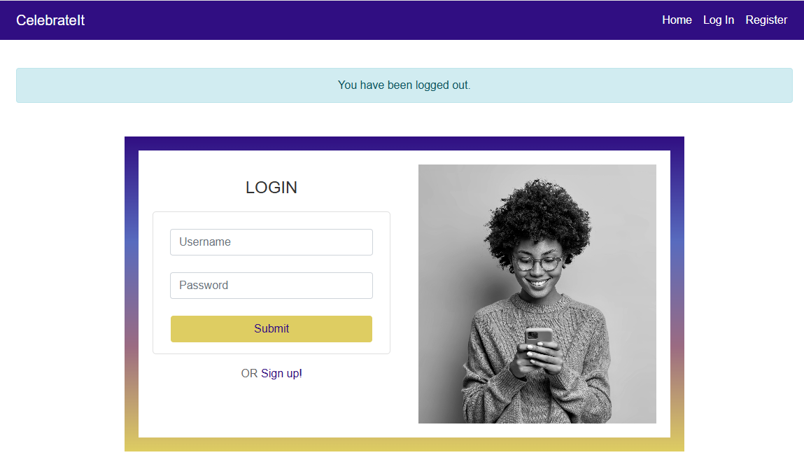

</details>

<details>
<summary> 5/ Conditional Menu Options when logged out </summary>


</details>

<details>
<summary> 6/ Conditional Menu Options when logged in </summary>


</details>

---

#### **Recognition & Nomination CRUD**

| **Priority** | **User Story**          | **Page(s)**            | **Test Scenario / Action**             | **Expected Result**                                 | Actual | **Screenshot** |
| ------------ | ----------------------- | ---------------------- | -------------------------------------- | --------------------------------------------------- | ------ | -------------- |
| Must Have    | Create Recognition      | Post Create Page       | Fill out form with content and submit  | Redirected to detail, new post shows in feed        | ✅     | 1              |
| Must Have    | Edit Recognition        | Feed > Edit Dropdown   | Change title or content and save       | Updated post appears in feed and detail             | ✅     | 2 - 3 - 4      |
| Must Have    | Delete Recognition      | Feed > Delete Dropdown | Click delete and confirm               | Post is removed from feed and not accessible by URL | ✅     | 5- 6           |
| Must Have    | View Recognition Detail | Feed > Click Card      | Click post preview in feed             | Full post loads with correct data                   |        |
| Must Have    | Create Nomination       | Nomination Create Page | Submit valid form with nominee and tag | Redirect to detail, nomination shows in feed        |        |
| Must Have    | Edit Nomination         | Feed > Edit Dropdown   | Update text or tags                    | Updated nomination shown in feed and detail         |        |
| Must Have    | Delete Nomination       | Feed > Delete Dropdown | Delete a nomination and confirm        | Nomination disappears from feed and is inaccessible |        |
| Must Have    | View Nomination Detail  | Feed > Click Card      | Click on nomination preview            | Full nomination loads with correct data             |        |
| Must Have    | View Recognition Feed   | Homepage               | Open homepage                          | Feed shows latest recognitions, ordered by date     |        |
| Must Have    | View Nomination Feed    | Toggle in Homepage     | Use toggle to switch feed type         | Feed updates to show only nominations               |        |

<details>
<summary> 1/ Create Recognition – Successful message </summary>

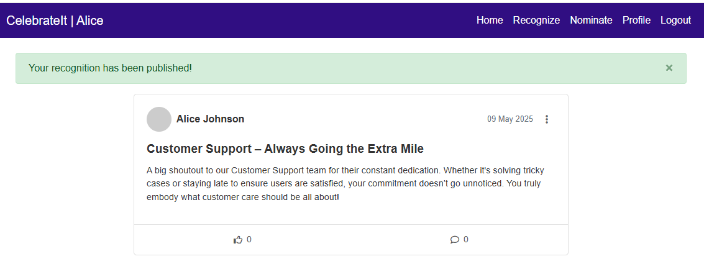

</details>

<details>
<summary> 2/ Edit Recognition – Dropdown feed </summary>

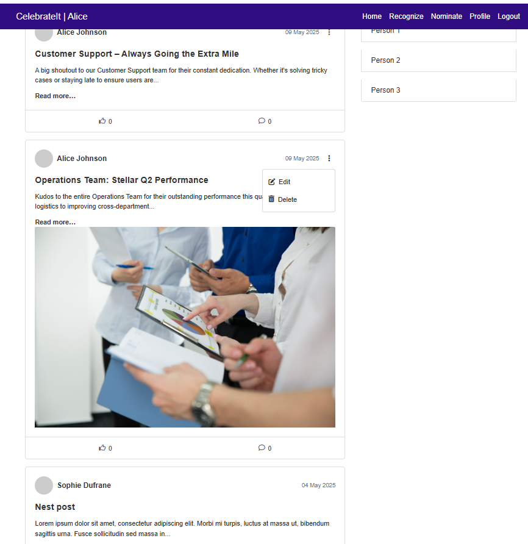

</details>

<details>
<summary> 3/ Edit Recognition – Form pre-filled </summary>

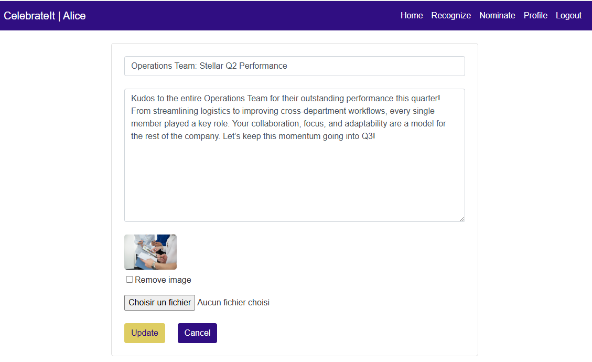

</details>

<details>
<summary> 4/ Edit Recognition – Successful message </summary>


</details>

<details>
<summary> 5/ Delit Recognition - Confirmation prompt </summary>

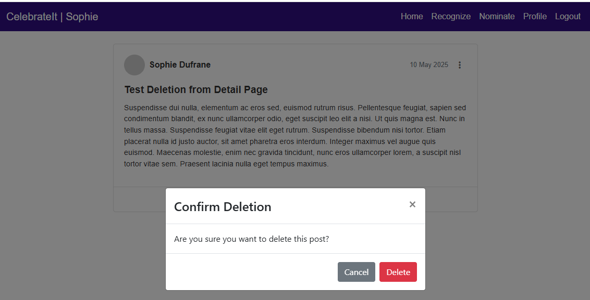

</details>

<details>
<summary> 6/ Delit Recognition > Successful message </summary>


</details>

#### **Engaging with People & Posts**

| **Priority** | **User Story**         | **Page(s)**     | **Test Scenario / Action**            | **Expected Result**                                   | Actual | **Screenshot** |
| ------------ | ---------------------- | --------------- | ------------------------------------- | ----------------------------------------------------- | ------ | -------------- |
| Must Have    | Comment on Post        | Detail Page     | Submit valid comment                  | Comment appears below post                            |        |
| Should Have  | Like a Post            | Feed / Detail   | Click like and unlike                 | Count updates and button toggles correctly            |        |
| Should Have  | Edit/Delete My Comment | Detail Page     | Click edit or delete on owned comment | Comment updates or disappears as expected             |        |
| Should Have  | Search for Colleagues  | Feed Search Bar | Type partial name                     | Matching users show with avatar + \"Nominate\" button |        |

#### **Managing My Profile & Network**

| **Priority** | **User Story**       | **Page(s)**            | **Test Scenario / Action**                          | **Expected Result**                           | Actual | **Screenshot** |
| ------------ | -------------------- | ---------------------- | --------------------------------------------------- | --------------------------------------------- | ------ | -------------- |
| Should Have  | Edit My Profile      | Profile Edit Page      | Change avatar or bio and save                       | Profile updates and info reflects new data    |        |
| Must Have    | View Public Profiles | Feed / Detail > Author | Click username/avatar of another user               | Public profile loads with bio + list of posts |        |
| Could Have   | View My Own Posts    | My Profile Page        | Visit profile and review recognitions + nominations | All user-created posts appear with preview    |        |

### 6.3 Validators

- **CSS - HTML**

- **JavaScript**

- **Python**

- **Lighthouse Performance & Best Practices Testing**

### 6.3 Bugs and Fixes

- List known bugs

- Unresolved issues

---

## 7. Deployment

### 7.1 Heroku

The site was deployed successfully to [Heroku]() following the steps below:

1. In _Gitpod_, create a list of dependencies in `requirements.txt` file:
   - Run `pip3 freeze > requirements.txt` in the terminal.
   - Create _Procfile_
2. In _Heroku_ account, create the new App:
   - Select `New` and `Create a new app`.
   - Name the App (name must be unique) and choose a region: `Europe`
   - Click `Create App`.
3. In the new App page, access to the `Settings` section.
4. In `Config Var` add :
   - `DATABASE_URL` and its value.
   - `SECRET_KEY` and its value.
   - `CLOUDINARY_URL` and its value.
   - Click `Add`.
5. Access to the `Deploy` section.
6. Select the deployment method:
   - Select `GitHub`
   - Search for the repository by taping the name in the search barre.
   - Click on `Connect`
7. Click `Deploy Branch`.
8. Once App deployed, the message _Your app was successfully deployed._

The live link can be found here: [CelebrateIt]()

### 7.1 Forking and Cloning

Forking the repository creates a copy of this project, allowing modifications without affecting the original code. Once the repository is forked, it can be cloned to a local machine for development.</br>
Follow these steps to fork, clone, and work on the project:

- **Fork the repository**

  - Go to the repository you want to fork on [GitHub](https://github.com/).
  - In the top-right corner of the page, click `Fork`.
  - Name the new forked repository, then click `Create Fork`.
  - This creates a copy of the repository under your own GitHub account.

- **Clone the forked repository**
  - In the forked repository on GitHub, above the list of files, click `Code`.
  - Copy the URL for the repository (either HTTPS or SSH).
  - Open a terminal (or Git Bash).
  - Type `git clone`, then paste the copied URL.
  - Press `Enter`.
  - Navigate to the newly cloned repository directory: `cd` and the repository name.

## 8. Credit

### **Content & Resources**

### **Acknowledgements**
